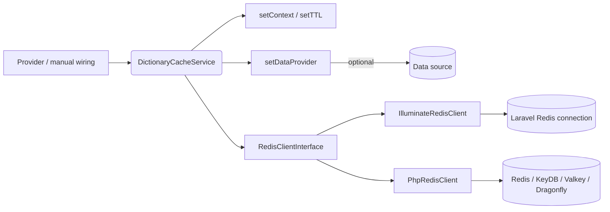
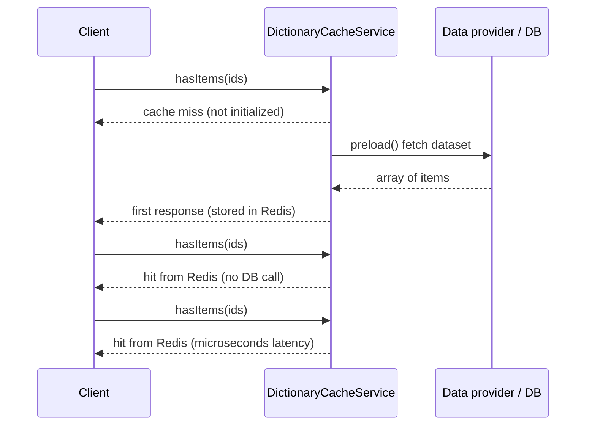

# Dictionary Cache Service

[](https://packagist.org/packages/alyakin/dictionary-cache-service)
[](https://packagist.org/packages/alyakin/dictionary-cache-service)
[](https://github.com/2177866/dictionary-cache-service/actions/workflows/ci.yml)


Dictionary caching based on Redis-compatible stores (Redis, KeyDB, Valkey, Dragonfly, Ardb, etc.).

## Contents
- [Installation](#installation)
- [Examples](#examples)
- [Methods](#methods)
  - [Creating an object](#__construct)
  - [Setup scope for cache](#setcontext)
  - [Set data provider](#setdataprovider)
  - [Set cache Time To Live (TTL)](#setttl)
  - [Get cache Time To Live (TTL)](#getttl)
  - [Manually preload cache](#preload)
  - [Check one item in cache](#hasitem)
  - [What items from the list are in the cache](#hasitems)
  - [Get all elements from cache](#getallitems)
  - [Checking if cache is loaded](#exists)
  - [Manually add elements to cache](#additems)
  - [Manually remove element from the cache](#removeitem)
  - [Reset TTL countdown](#keepalive)
  - [Clear cache for the scope](#clear)
- [Supported Databases](#supported-databases)
- [Requirements](#requirements)
- [Contributing](#want-to-contribute)
- [License](#license)

## Installation

Install via Composer:

```sh
composer require alyakin/dictionary-cache-service
```

This package is framework-agnostic: it does not bootstrap a Redis connection on its own. Provide an implementation of `Alyakin\DictionaryCache\Contracts\RedisClientInterface` (or one of the bundled adapters) when constructing the service.

Available adapters:
- `Alyakin\DictionaryCache\Adapters\IlluminateRedisClient` - wrap Laravel's `Redis::connection()`.
- `Alyakin\DictionaryCache\Adapters\PhpRedisClient` - reuse the native `\Redis` / `\RedisCluster` extension.
- Custom implementations - implement the interface if you rely on another Redis library.

## Examples





### Laravel: warm a dictionary from the database

Register the bundled service provider (auto-discovered in Laravel packages) and resolve the service from the container. The provider injects an `IlluminateRedisClient` that wraps `Redis::connection()`.

```php
use Alyakin\DictionaryCache\Adapters\PhpRedisClient;
use Alyakin\DictionaryCache\Services\DictionaryCacheService;

$cartCache = app(DictionaryCacheService::class);

$cartCache
    ->setContext("user_{$userId}", 'cart')
    ->setDataProvider(function () use ($userId) {
        return UserCart::whereUserId($userId)
            ->pluck('product_id')
            ->map(fn ($id) => (string) $id)
            ->all();
    })
    ->setTTL(3600);

$cartCache->preload();

if ($cartCache->hasItem((string) $productId)) {
    // product already in cart
}
```

### Plain PHP: manual dictionary without a data provider

```php
use Alyakin\DictionaryCache\Adapters\PhpRedisClient;
use Alyakin\DictionaryCache\Services\DictionaryCacheService;

$redis = new \Redis();
$redis->connect('127.0.0.1', 6379);

$flagsCache = new DictionaryCacheService(
    redisInstance: new PhpRedisClient($redis)
);

$flagsCache->setContext("tenant_{$tenantId}", 'feature_flags')
    ->setTTL(600)
    ->addItems(['new_checkout', 'promo_banner']);

$enabledFlags = $flagsCache->hasItems(['new_checkout', 'beta_feed']);

if (in_array('new_checkout', $enabledFlags, true)) {
    // enable experiment
}

$flagsCache->keepAlive(); // refresh TTL to keep feature flags hot
```

## Methods

### `__construct`
Initializes the service with optional context, data provider, and Redis connection.

**Parameters:**
  - `contextId` _(optional, string)_: Unique identifier for the cache.
  - `dataProvider` _(optional, Closure)_: Function that returns an array of items to be cached.
  - `redisInstance` _(optional, RedisClientInterface|\Redis|\RedisCluster)_: Provide your own Redis client or adapter. When omitted inside Laravel, the bundled service provider injects the default connection.

```php
use Alyakin\DictionaryCache\Services\DictionaryCacheService;

// $redis is an existing \Redis or compatible connection.

$userCartCache = new DictionaryCacheService(
    contextId: $userId,
    dataProvider: $myDataProviderCallback,
    redisInstance: new PhpRedisClient($redis)
);
```

### `setContext`
Sets the cache key using a context ID and an optional prefix. All class methods use the scope set by this method.

**Parameters:**
  - `contextId` _(required, string)_: Unique identifier for the context.
  - `key` _(optional, string)_: Prefix for the cache key (default: `dictionary`).

```php
$userCartCache->setContext('user_'.$userId, 'cart');
$userFavoriteProductsCache->setContext('user_'.$userId, 'favorite_products');
```

### `setDataProvider`
Sets a function that provides data for cache preloading. This method will only be called if the cache has not been initialized yet.

**Parameters:**
  - `dataProvider` _(required, Closure)_: Function returning an array of items.

```php
$userCartCache->setDataProvider(
    function () use ($userId) {
        return UserCart::whereUserId($userId)->pluck('id')->toArray();
    }
);
```

### `setTTL`
Sets the TTL (time-to-live) for the cache key.

**Parameters:**
  - `ttl` _(required, int)_: TTL in seconds (must be >= 1).

```php
$userCartCache = new DictionaryCacheService();
$userCartCache
    ->setContext('user_'.$userId, 'cart')
    ->setDataProvider(fn () => ['19', '33', '7'])
    ->setTTL(3600 * 24);
```

### `getTTL`
Retrieves the TTL of the cache key. If not set, returns default (3600).

### `preload`
Loads data into the cache using the data provider if it is not initialized. Throws a `RuntimeException` when a data provider was not configured.

### `hasItem`
Checks if a specific item exists in the cache.

**Parameters:**
  - `itemId` _(required, string)_: Item to check.

```php
$inCart = $userCartCache->hasItem($productId);
return $inCart;
```

### `hasItems`
Checks which items from the list exist in the cache.

**Parameters:**
  - `itemIds` _(required, array)_: List of item IDs.

```php
$productList = Product::recommendedFor($productId)->get()->pluck('id')->toArray();
$productsInCart = $userCartCache->hasItems($productList);
$recommendations = array_diff($productList, $productsInCart);
return $recommendations;
```

### `getAllItems`
Retrieves all cached items.

### `exists`
Checks if the cache exists for the scope.

### `addItems`
Adds multiple items to the cache.

```php
public function handle(ProductAddedToCart $event): void {
    $this->cartCache->setContext("user_{$event->userId}", 'cart');
    if ($this->cartCache->exists()) {
        $this->cartCache->addItems([(string) $event->productId]);
    }
}
```

**Parameters:**
  - `items` _(required, array)_: Items to add.

### `removeItem`
Removes a specific item from the cache.

**Parameters:**
  - `item` _(required, string)_: Item to remove.

```php
$this->cartCache->removeItem((string) $event->productId);
```

### `keepAlive`
Refreshes the expiration time of the cache key without modifying TTL.

```php
$this->cartCache->removeItem((string) $event->productId)->keepAlive();
```

### `clear`
Clears the cached data but keeps TTL settings.

## Supported Databases

The service works with **Redis-compatible** databases supported by Laravel's Redis driver:
- **Redis** (all versions)
- **KeyDB**
- **Valkey**
- **Dragonfly** (tested with Redis-compatible API)
- **Ardb** (not covered by CI; no maintained public Docker image available)

## Requirements

- PHP **7.4+**
- Redis-compatible storage
- Laravel **8+** _(optional, only for automatic service provider registration)_

## Development

Install dependencies and run the local toolchain:

```sh
composer install
composer check # runs lint + phpstan + tests
```

Individual commands:

- `composer lint` – Laravel Pint (`pint --test` in CI).
- `composer stan` – PHPStan level 9.
- `composer test` – PHPUnit (unit + integration; requires a running Redis-compatible server and ext-redis).

GitHub Actions (`.github/workflows/ci.yml`) runs a matrix of PHP 8.1–8.3 against Redis/KeyDB/Valkey/Dragonfly. Ardb is excluded because there is no publicly available Docker image; test it manually if your project relies on it.

## Want to Contribute?

Read [CONTRIBUTING.md](CONTRIBUTING.md) for setup instructions, coding style, and testing requirements. Please follow the [Code of Conduct](CODE_OF_CONDUCT.md) and report security issues privately via [SECURITY.md](SECURITY.md).

Check out the [open issues](https://github.com/alyakin/dictionary-cache-service/issues) - especially those labeled [good first issue](https://github.com/alyakin/dictionary-cache-service/issues?q=is%3Aissue+is%3Aopen+label%3A%22good+first+issue%22)!

Feel free to fork the repo, open a PR, or suggest improvements.

## License

This package is open-source and available under the **MIT License**.

